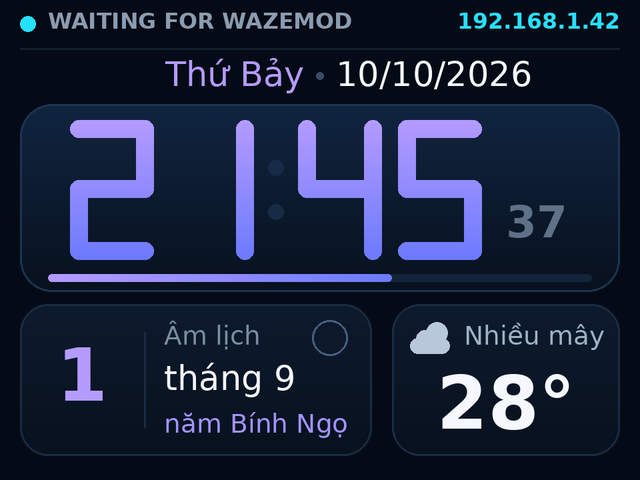
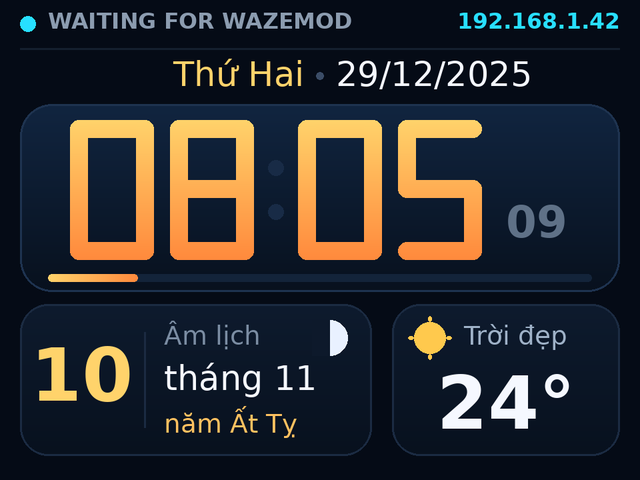
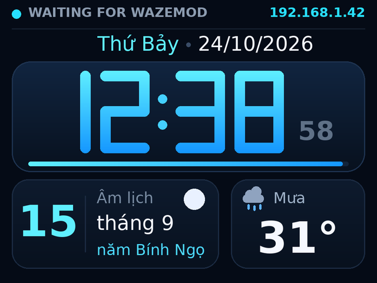
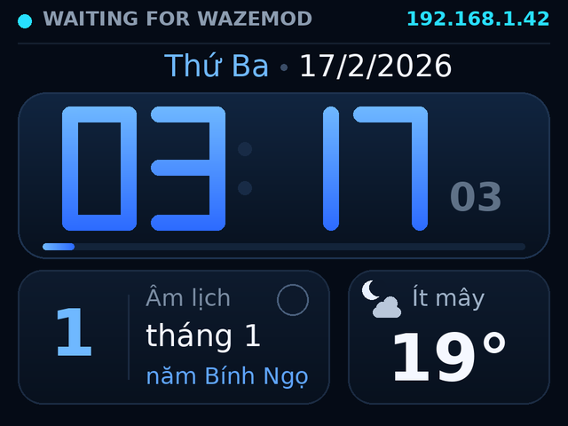
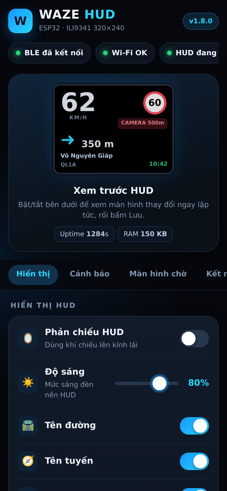
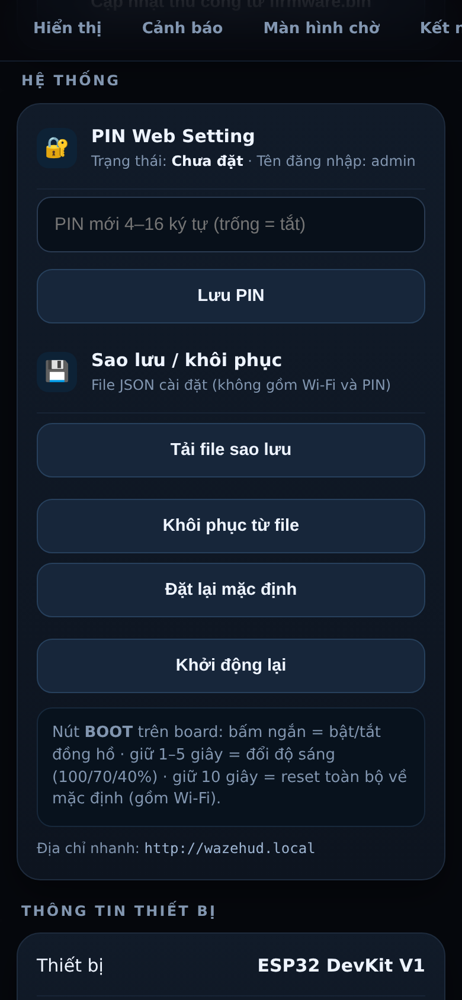
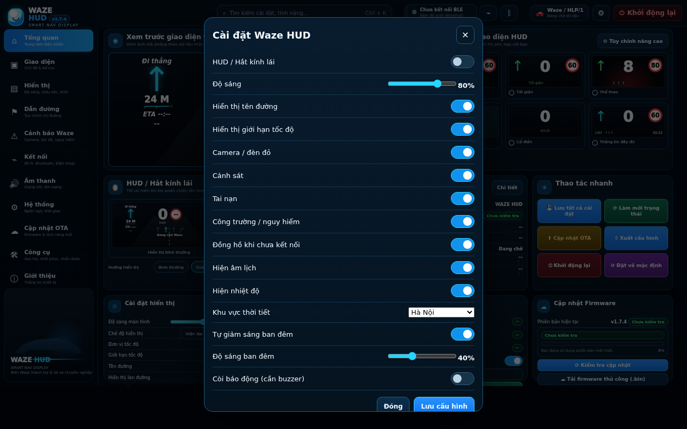

# ESP32 Waze HUD Mod

HUD 320x240 dành cho **ESP32 DevKit V1 + ILI9341**. TFT không cần cảm ứng: màn hình chỉ hiển thị HUD, toàn bộ cấu hình thực hiện bằng web trên điện thoại.

## Tính năng

- HUD điều hướng 320x240 nền đen, tương phản cao.
- Tốc độ hiện tại và biển giới hạn tốc độ.
- Mũi tên rẽ, khoảng cách, tên đường, ETA, quãng đường còn lại và tên tuyến.
- Cảnh báo Waze/Waze mod: police, camera, crash, traffic, roadworks, pothole, object, car on shoulder, broken light, closure, bad weather, blocked lane, high-risk area, animal.
- Web Setting trên điện thoại:
  - hiển thị HUD;
  - cảnh báo;
  - Wi-Fi;
  - trạng thái Android bridge;
  - kiểm tra và cập nhật firmware online;
  - thông tin thiết bị.
- Cấu hình lưu bằng ESP32 Preferences.
- Android bridge gồm NotificationListenerService + AccessibilityService.
- BLE GATT: điện thoại quét thiết bị `WAZE-HUD` và truyền dữ liệu HUD trực tiếp qua BLE; Wi-Fi chỉ còn dùng cho Web Setting, test HTTP và OTA.
- GitHub Actions build firmware.
- GitHub Release tự đính kèm `firmware.bin` khi push tag `v*`.

## Ảnh minh họa

Ảnh dưới đây là **mô phỏng** (dựng từ cùng bố cục với firmware), không phải ảnh chụp thiết bị thật; font trên màn hình thật có thể lệch vài pixel.

| Màn hình chờ buổi tối | Buổi sáng | Ban ngày, mưa | Ban đêm |
|---|---|---|---|
|  |  |  |  |

| Web Setting | Hệ thống | Studio |
|---|---|---|
|  |  |  |

## Tài liệu

- [Sơ đồ nối dây và linh kiện tùy chọn](docs/WIRING.md)
- [Kiểm thử](docs/TESTING.md)
- [Mẫu vỏ in 3D](docs/CASE.md)
- [Giao thức BLE/HTTP](PROTOCOL.md)

## Phần cứng

| ILI9341 | ESP32 DevKit V1 |
|---|---:|
| CS | GPIO27 |
| RST | GPIO25 |
| DC | GPIO26 |
| MOSI | GPIO13 |
| SCK | GPIO14 |
| MISO | GPIO35 |

Logic 3.3V.

## Cài thư viện Arduino

- Adafruit GFX Library
- Adafruit ILI9341
- ArduinoJson 7.x

### Bắt buộc khi build bằng Arduino IDE

Firmware BLE v1.2.x lớn hơn partition mặc định 1.31 MB của ESP32. Trong Arduino IDE chọn:

- **Board:** ESP32 Dev Module
- **Flash Size:** 4MB (32Mb)
- **Partition Scheme:** **Minimal SPIFFS (1.9MB APP with OTA/190KB SPIFFS)**  
  (một số bản ESP32 core mới có thể ghi **130KB SPIFFS** thay vì 190KB)
- Lần nạp đầu sau khi đổi partition: có thể bật **Erase All Flash Before Sketch Upload**

Sau khi chọn đúng, lúc Verify dòng dung lượng phải báo gần:

`Maximum is 1966080 bytes`

Nếu vẫn hiện:

`Maximum is 1310720 bytes`

thì Arduino IDE vẫn đang dùng partition mặc định.

Repo cũng có sẵn `partitions.csv`. Nếu dùng custom partition tự động, file này phải nằm **cùng thư mục sketch** với `ESP32_WAZE_HUD.ino` và đúng tên `partitions.csv` (không phải `partitions.csv.txt`).

Firmware BLE lớn hơn giới hạn app mặc định của ESP32. Repo có sẵn `partitions.csv` với 2 OTA slot ~1.9 MB. Khi dùng Arduino IDE, hãy giữ `partitions.csv` cùng thư mục với `ESP32_WAZE_HUD.ino` để build và OTA đúng phân vùng.

## Sử dụng

### Kết nối BLE

1. Nạp firmware v1.2.0 trở lên cho ESP32.
2. Mở app Android Bridge và cấp quyền Bluetooth/BLE.
3. Bấm **Quét & kết nối WAZE-HUD**.
4. Khi trạng thái báo **Đã kết nối WAZE-HUD**, dữ liệu điều hướng được gửi qua BLE.

ESP32 advertise BLE với tên `WAZE-HUD`. 
### Màn hình chờ (đồng hồ)

Khi chưa nhận dữ liệu từ điện thoại (hoặc mất kết nối quá 30 giây), TFT hiển thị màn hình chờ: đồng hồ số 7 đoạn, ngày dương lịch, **âm lịch** (kèm năm Can Chi, tháng nhuận) và **nhiệt độ** ngoài trời.

- Giờ lấy từ NTP qua Wi-Fi. ESP32 không có pin RTC, nên khi không có Wi-Fi, app Android bridge gửi giờ điện thoại qua BLE (xem `PROTOCOL.md`).
- Nhiệt độ lấy từ Open-Meteo (không cần API key), cập nhật 15 phút/lần, chỉ gọi khi đang ở màn hình chờ. Cần Wi-Fi có internet.
- Web Setting → **Màn hình chờ**: bật/tắt đồng hồ, âm lịch, nhiệt độ và chọn khu vực thời tiết.
- Âm lịch tính bằng thuật toán Hồ Ngọc Đức (múi giờ UTC+7), không cần tải dữ liệu.

### Wi-Fi / Web Setting

Lần đầu nếu chưa có Wi-Fi, ESP32 tạo AP:

- SSID: `WAZE-HUD`
- Password: `12345678`
- Web: `http://192.168.4.1`

Sau khi cấu hình Wi-Fi, mở địa chỉ IP ESP32 bằng trình duyệt trên điện thoại. TFT không cần cảm ứng.

## API HUD

`POST /hud`

```json
{
  "turn": "right",
  "distance_m": 350,
  "road": "Vo Nguyen Giap",
  "speed": 62,
  "speed_limit": 60,
  "remaining_km": 8.6,
  "eta": "10:42",
  "route": "QL1A",
  "alert": {
    "type": "camera",
    "distance_m": 500
  }
}
```

Xem thêm `PROTOCOL.md`.

## OTA online

Firmware gọi GitHub Releases API để kiểm tra release mới nhất của:

`ledinhtien219/waze-mod`

Release phải có asset tên `firmware.bin`.

Quy trình phát hành:

```bash
git tag v1.1.0
git push origin v1.1.0
```

Workflow `Release Firmware` sẽ compile PlatformIO và tạo GitHub Release có `firmware.bin`. Sau đó thiết bị có thể vào web Setting > Cập nhật online > Kiểm tra cập nhật > Tải về & cập nhật.

Không tắt nguồn khi ESP32 đang ghi firmware.

## Android bridge

Mở thư mục `android-bridge` bằng Android Studio, build APK, nhập IP ESP32 rồi bật quyền Notification Access và Accessibility nếu muốn đọc thêm dữ liệu đang hiển thị trong Waze/Waze mod.

Parser hiện tại là best-effort vì text/layout của từng Waze mod có thể khác nhau theo phiên bản và ngôn ngữ.


## Giao diện đề xuất

Dự án dùng mô hình **màn TFT chỉ hiển thị HUD**, không cần cảm ứng. Toàn bộ cài đặt được thao tác trên điện thoại bằng trình duyệt web.

### TFT 320×240

Màn hình ILI9341 chỉ dùng cho các trạng thái:

- HUD điều hướng khi đang chạy.
- Waiting / chưa nhận dữ liệu từ điện thoại.
- Mất kết nối bridge.
- Đang cập nhật firmware OTA.

Bố cục HUD chính:

- Cột trái: tốc độ hiện tại, biển giới hạn tốc độ, cảnh báo camera gần.
- Khu vực giữa: khoảng cách tới lần rẽ tiếp theo, mũi tên điều hướng lớn, tên đường.
- Cột phải: cảnh báo Waze/WAZE mod gần nhất.
- Thanh dưới: quãng đường còn lại, ETA và tên tuyến.

### Web Setting trên điện thoại

Mở địa chỉ IP ESP32 bằng trình duyệt để cấu hình:

- Hiển thị HUD.
- Chế độ ban đêm.
- Phản chiếu HUD.
- Hiển thị tên đường.
- Hiển thị tuyến đường.
- Hiển thị ETA.
- Hiển thị biển giới hạn tốc độ.
- Bật/tắt cảnh báo Police.
- Bật/tắt Camera.
- Bật/tắt Crash.
- Bật/tắt Traffic.
- Bật/tắt Roadworks.
- Bật/tắt nhóm cảnh báo khác.
- Cấu hình Wi-Fi.
- Kiểm tra trạng thái Android Bridge.
- Gửi dữ liệu HUD mẫu.
- Kiểm tra và cài đặt firmware online.
- Xem thông tin thiết bị.

### Luồng sử dụng

```text
Waze / WAZE mod trên Android
        ↓
Android Bridge
NotificationListener + Accessibility
        ↓ HTTP JSON
ESP32
        ↓
ILI9341 320×240 HUD

Điện thoại
        ↓ trình duyệt
Web Setting trên ESP32
```

## Cập nhật online

Trang Web Setting có mục **Cập nhật online** gồm:

- Firmware hiện tại.
- Phiên bản mới nhất trên GitHub.
- Kiểm tra cập nhật.
- Tải về và cập nhật.
- Tự động kiểm tra khi khởi động.

Quy trình:

```text
ESP32
  ↓
GitHub Releases API
  ↓
release mới nhất
  ↓
firmware.bin
  ↓ HTTPS
Update.writeStream()
  ↓
ESP32 restart
```

Trong lúc cập nhật TFT sẽ hiển thị:

```text
UPDATING
DO NOT POWER OFF
```

Không tắt nguồn trong quá trình ghi firmware.

## Mockup giao diện

Mockup dự kiến gồm hai phần:

1. **HUD 320×240 trên ILI9341**: tối giản, dễ đọc khi lái xe.
2. **Web Setting trên điện thoại**: giao diện tối, các nhóm cài đặt rõ ràng và có mục cập nhật OTA online.

Ảnh mockup nên được lưu trong repo ở `docs/` nếu muốn hiển thị trực tiếp trong README.


## BLE HLP/1 tương thích WazeMod

Firmware v1.2.1 dùng đúng transport BLE HLP/1 của WazeMod:

- Tên BLE: `WazeHUD`
- Service: `8a7e0001-4d6e-4c48-9a9d-484c504c0001`
- Android → HUD TX: `8a7e0002-4d6e-4c48-9a9d-484c504c0001`
- HUD → Android RX notify: `8a7e0003-4d6e-4c48-9a9d-484c504c0001`
- Capabilities: `8a7e0004-4d6e-4c48-9a9d-484c504c0001`

Trong WazeMod hãy vào HUD Link → Chọn thiết bị và chọn `WazeHUD` dạng BLE. Không chọn Bluetooth Classic cho firmware BLE này.


## Firmware v1.2.2 — ổn định BLE và chống nháy TFT

- BLE GATT callback chỉ copy ATT chunk vào FreeRTOS queue; parse HLP/1 và render chạy ngoài callback.
- Frame được ghép theo LF và giới hạn 512 byte.
- TFT dùng dirty-region rendering: không còn `fillScreen()` mỗi state/heartbeat.
- HLP state giống hệt nhau được WazeMod gửi mỗi giây sẽ không làm màn hình redraw.
- Trạng thái LINK LOST chỉ redraw khi thực sự chuyển trạng thái.
- Wi-Fi connect timeout khởi động giảm còn 6 giây; BLE chỉ advertise sau khi bước Wi-Fi setup hoàn tất để tránh nhận kết nối khi main loop chưa chạy.


## Firmware v1.2.3 — BLE discovery diagnostics

- HLP service UUID được đặt trực tiếp trong BLE advertising packet để WazeMod picker lọc chắc chắn.
- Tên `WazeHUD` nằm trong scan response.
- Serial Monitor in BLE address thực tế của ESP32.
- Web `/state` trả thêm `ble_name` và `ble_address`.
- Khi dùng WazeMod built-in HUD Link, hãy chọn transport **BLE GATT** và chọn lại thiết bị sau khi flash; bản ghi Classic cũ không tự đổi transport chỉ vì chọn "Tự động".


## Firmware v1.2.4 — Arduino IDE compatibility

- Thêm prototype thủ công cho `parseHlpTurn(JsonDocument &doc)` để tránh lỗi auto-prototype của Arduino IDE: `TurnType does not name a type`.
- Chuẩn hoá `BLECharacteristic::getValue()` qua `.c_str()` sang Arduino `String`, tương thích cả ESP32 core trả `std::string` lẫn core mới trả `String`.


## Firmware v1.3.0 — HUD UI redesign

- Bố cục mới tối giản kiểu ô tô: road/distance ở header, speed card bên trái, maneuver lớn ở giữa, alert/link card bên phải, ETA/remaining/route ở footer.
- Bỏ các box `NAV ACTIVE`, `NEXT` thừa và giảm chữ nhỏ.
- Màu nền đen, cyan làm accent, vàng chỉ dùng cho distance/cảnh báo.
- Waiting screen được làm lại gọn hơn.
- Vẫn giữ dirty-region rendering để không nháy toàn màn hình.


## Firmware v1.3.1 — HLP/1 data fix, alerts, Wi-Fi IP & smoother TFT

- Parse đúng state HLP/1: `trn`, `dst`, `st/st2`, `rm/rkm`, `alr/alrD/alrV/alrS/alrM`.
- Khai báo `dev.want.fields` đúng chuẩn và opt-in `alrs` để nhận tối đa 4 cảnh báo phía trước.
- Hỗ trợ mã cảnh báo HLP/1 0..75, gồm camera, police, traffic jam, roadwork, biển cấm, đèn giao thông và các cảnh báo mở rộng.
- Alert gần nhất hiển thị đúng label, khoảng cách, giá trị tốc độ hoặc mức ùn tắc/phút chậm khi có.
- Web `/state` có thêm alert diagnostics.
- Boot screen hiển thị trạng thái Wi-Fi và IP DHCP/AP mới ngay khi kết nối.
- TFT SPI tăng từ 20 MHz lên 40 MHz để giảm thời gian redraw.


## Firmware v1.3.6 — balanced HUD, clearer NOW/NEXT and live IP

- Cân lại layout 320x240: SPEED 88px, NEXT maneuver 124px, alert 84px.
- NOW/NEXT speed limits tách rõ hai cột; NEXT hiện khoảng cách đến giới hạn tốc độ kế tiếp.
- Mũi tên nhỏ hơn và phân biệt straight/left/right/slight/sharp/keep/exit/U-turn/roundabout/arrive.
- Map HLP `trn` sang đúng nhóm maneuver thay vì ép sharp/keep/exit thành left/right.
- Header hiển thị tên đường đã bỏ dấu Unicode an toàn và IP Wi-Fi/AP hiện tại.
- IP trên màn chính tự đổi sau khi DHCP cấp địa chỉ mới.
- Giữ hệ thống alert HLP và icon cảnh báo chuyên biệt của v1.3.5.


## Firmware v1.3.7 — Wi-Fi reconnect fix

- Loại bỏ việc gọi lại `WiFi.begin()` khi STA vẫn đang kết nối; đây là nguyên nhân log `sta is connecting, cannot set config`.
- Chỉ nạp SSID/password một lần lúc boot.
- Fallback AP `WAZE-HUD` không ghi đè station config.
- Background retry dùng `WiFi.reconnect()` mỗi 15 giây.
- Tắt Arduino auto-reconnect để tránh hai cơ chế reconnect chạy chồng nhau.
- Serial log thêm Wi-Fi disconnect reason và `/state` có `wifi_disconnect_reason`.


## Firmware v1.4.0 — 3 HUD layouts + smooth fonts

- Thêm 3 bố cục chọn trong Web Setting: Balanced, Navigation và Minimal.
- Lưu bố cục bằng Preferences, reboot vẫn giữ.
- Chuyển các chữ chính sang FreeSans/FreeSansBold GFX fonts để nét mượt hơn trên ILI9341.
- Balanced: cân bằng tốc độ, maneuver, alert.
- Navigation: ưu tiên mũi tên và khoảng cách đến lần rẽ.
- Minimal: giao diện thoáng, ít khung, tốc độ + maneuver nổi bật.
- Giữ IP Wi-Fi/AP trên header và toàn bộ HLP alert / NOW / NEXT logic.


## Firmware v1.4.1 — robust online OTA

- OTA không còn tải/ghi firmware ngay bên trong WebServer request.
- Nút update trả HTTP 202 trước, firmware thực hiện download/write sau trong loop.
- Thêm `/update-status` và trạng thái queued/downloading/writing/success/failed.
- Kiểm tra `ESP.getFreeSketchSpace()` trước khi ghi.
- Timeout HTTPS dài hơn cho GitHub Release.
- Serial log HTTP code, Content-Length, số byte đã ghi và mã lỗi `Update`.
- Web hiển thị nguyên nhân lỗi OTA thay vì chỉ báo chung chung.


## Firmware v1.4.2 — Waze alert icon mapping 0..75

- Đối chiếu enum/mapping HLP alert 0..75 với WazeHUD-CYD-2.8 release 1.1.2.
- Không chép bitmap GPL; icon được vẽ lại bằng primitive Adafruit_GFX để giữ firmware nhẹ và độc lập.
- Thêm icon riêng cho police, các loại camera, red-light camera, accident, jam, closure, roadwork, pothole, railway, toll, restriction signs, flood/fog/hail/snow/ice, cyclist, emergency, traffic light và các mã HLP mở rộng.
- SPEED_DROP / END_SPEED_RESTRICTION dùng trực tiếp giá trị `alrV` để vẽ biển tốc độ.
- Traffic jam dùng `alrS` để hiện mức độ.
- Bỏ IP khỏi màn HUD chính; IP vẫn còn ở boot/settings để cấu hình OTA.
- Bỏ ONLINE / NO ALERT khỏi vùng alert khi đang lái.


## Firmware v1.5.0 — Final Full HUD

- Thêm style 3 **Full HUD (Chốt)** và migrate một lần để thiết bị hiện style này mặc định.
- Bố cục bám theo mockup cuối: instruction trên cùng, maneuver + khoảng cách bên trái, tốc độ cực lớn giữa, biển giới hạn tốc độ lớn, alert stack bên phải, ETA/lane/road/clock ở dưới.
- Bỏ hoàn toàn mục ắc quy / 14.0V.
- Lane guidance có 4 hướng: hướng maneuver hiện tại sáng cyan; các hướng chưa chọn giảm sáng mạnh bằng dark gray.
- Sử dụng FreeSansBold24pt cho tốc độ chính và gom redraw trong một SPI transaction để nét/nhanh hơn trên ILI9341.
- HUD chính không hiện IP / ONLINE / NO ALERT.
- IP chỉ còn ở màn boot/settings.
- Clock dùng NTP UTC+7 khi Wi-Fi có Internet.
- Giữ mapping alert HLP 0..75 và OTA robust từ v1.4.x.


## Firmware v1.5.1 — branded boot + real OTA progress

- Thêm logo nhận diện WazeHUD nguyên bản bằng vector Adafruit_GFX, không dùng bitmap nặng.
- Màn khởi động có logo, tên sản phẩm, version và progress theo các bước SETTINGS / NETWORK / BLE / WEB / UPDATE CHECK / READY.
- OTA chuyển từ `Update.writeStream()` sang stream 1 KB có đo byte thực tế.
- Màn TFT hiển thị thanh tiến trình OTA thật 0–99%, bước VERIFYING và 100% UPDATE COMPLETE.
- Trang Web Setting có progress bar và phần trăm OTA đồng bộ qua `/update-status`.
- Trong khi OTA, firmware vẫn phục vụ `/update-status` để trình duyệt cập nhật tiến trình.
- Giữ nguyên Full HUD v1.5.0 và toàn bộ HLP alert / Wi-Fi / BLE.


## Firmware v1.6.0 — LVGL renderer

- Thay renderer Adafruit_GFX thủ công bằng LVGL 8.3.11 cho Full HUD.
- Partial display buffer 320×16, không cần PSRAM/full framebuffer.
- Montserrat anti-aliased cho toàn bộ text chính: title, speed, ETA, alert, road, clock.
- HUD chỉ giữ một layout Full HUD để giảm flash và tránh hai renderer chạy song song.
- Maneuver + lane guidance được vẽ trên canvas LVGL: route active cyan sáng, lane khác giảm sáng mạnh.
- Boot logo, waiting screen và OTA progress chuyển sang LVGL.
- BLE HLP/1, Wi-Fi, Web Setting và OTA logic giữ nguyên.

- LVGL branch chuyển Bluetooth stack từ Bluedroid BLE Arduino sang NimBLE-Arduino 1.4.3 để giảm flash nhưng giữ nguyên UUID/protocol HLP/1.

- LVGL chỉ chạy từ Arduino loop; NimBLE callback không render trực tiếp để tránh cross-task UI access.

- v1.7.1: Studio chỉ còn một giao diện Full HUD; thêm BLE Live HUD characteristic để preview tốc độ/chỉ hướng/cảnh báo trực tiếp từ Waze, sửa HUD mirror và software brightness hoạt động thật, đồng thời giữ tương thích cấu hình với firmware v1.7.0.


## Firmware v1.7.2 — ESP32 Wi-Fi/BLE coexistence boot fix

- Sửa boot loop tại `NimBLEDevice::init()` / `coex_core_enable()`.
- Không còn gọi `WiFi.setSleep(false)`; Wi-Fi modem sleep được giữ bật để ESP32 Wi-Fi + BLE coexistence hoạt động đúng.
- Khởi tạo BLE/Studio trước Wi-Fi để Web Bluetooth vẫn sẵn sàng ngay cả khi Wi-Fi lỗi hoặc timeout.
- Giảm thời gian chờ Wi-Fi ban đầu từ 20 giây xuống 8 giây.


## Firmware v1.7.3 — Studio BLE JSON framing fix

- Studio characteristics now call NimBLE `setValue(data, length)` explicitly.
- Prevents trailing buffer bytes from being exposed to Web Bluetooth JSON reads.
- Studio parser also strips NUL/trailing bytes for compatibility with older 1.7.x firmware.


## Firmware v1.7.4 — Studio dashboard becomes the HUD settings UI

- Restores the six-theme HUD library on the main Studio dashboard.
- Theme choice is saved through BLE in `settings.style`.
- Adds persisted lane visibility and km/h/mph selection.
- The same finalized dashboard is now the primary HUD configuration surface; it is no longer a visual-only mock.


## Firmware v1.7.5 — Reliable OTA manifest + manual recovery

- OTA checks a compact GitHub Pages `firmware.json` manifest first.
- GitHub Releases API is now a streaming/filter fallback instead of loading the full JSON response into RAM.
- Semantic version comparison prevents accidental downgrade.
- Local web UI can upload a `firmware.bin` directly into the OTA partition for recovery.

## Firmware v1.7.6 — data freshness, stale-state fixes, cheaper redraw

- HUD không còn giữ nguyên tốc độ/mũi tên cũ khi mất dữ liệu: sau 3 giây tốc độ chuyển xám, sau 6 giây hiện `LINK LOST` và ẩn giới hạn tốc độ/cảnh báo.
- Frame HLP/1 `s` được coi là snapshot đầy đủ: `spd`, `lim`, `rm/rkm` thiếu thì về 0 thay vì giữ giá trị cũ; `trn` thiếu hoặc lạ thì hiện đi thẳng thay vì mũi tên cũ.
- Dùng trường `nav`: khi không dẫn đường, ẩn mũi tên, khoảng cách, ETA, làn đường và quãng đường còn lại.
- Tốc độ làm tròn (`lroundf`) thay vì cắt phần thập phân.
- Giới hạn tốc độ kế tiếp chọn thay đổi gần nhất trong `alrs[]` thay vì phần tử đầu tiên.
- Khoảng cách làm tròn bước 10 m (<200 m) và 50 m (<1 km) để số không nháy liên tục.
- Mũi tên, làn đường, icon cảnh báo và label chỉ vẽ lại khi dữ liệu đổi (trước đây vẽ lại 4 lần/giây); đổi mirror/độ sáng vẫn repaint toàn màn hình.

## Firmware v1.7.7 — tiếng Việt có dấu, lần rẽ kế tiếp, cài đặt biển báo

- Tên đường và hướng dẫn (`Rẽ trái`, `Chếch phải`, `Vào vòng xuyến`...) hiển thị có dấu bằng font LVGL tự sinh (`vn_font_14.c`, `vn_font_18.c`): ASCII, Latin-1, toàn bộ chữ Việt. Ký tự không có trong font (CJK, emoji...) bị lọc để không hiện ô vuông.
- Font sinh bằng `tools/gen_fonts.sh` (Python + Pillow, không cần node). Muốn giữ kiểu chữ Montserrat gốc thì dùng `lv_font_conv`, lệnh mẫu nằm trong script.
- Hiển thị `trn2` (lần rẽ sau lần rẽ kế tiếp) ở góc dưới trái: `Sau: ↱`. Ẩn ở theme Minimal/Classic.
- Hiển thị số lối ra trong biểu tượng vòng xuyến từ trường HLP `exit` (giả định `exit` là số lối ra vòng xuyến, 1–9).
- Tách cài đặt **Biển báo** khỏi **Cảnh báo khác**: giới hạn tốc độ sắp tới, cấm rẽ/quay đầu, biển làn, trạm thu phí, đèn giao thông, khu dân cư... Có trong Web Setting và Studio. Mặc định bật.

## Firmware v1.8.0 — màn hình chờ, giao diện mới và độ bền

**Màn hình chờ** (khi chưa nhận dữ liệu từ điện thoại, hoặc sau 30 giây mất kết nối)
- Đồng hồ số 7 đoạn bo tròn, nét liền, màu gradient đổi theo buổi trong ngày; thanh tiến trình giây.
- Ngày dương lịch, **âm lịch** (năm Can Chi, tháng nhuận, icon pha trăng) và **nhiệt độ** kèm icon thời tiết ngày/đêm (Open-Meteo, 15 phút/lần).
- Giờ từ NTP qua Wi-Fi, hoặc từ điện thoại qua BLE (app Android bridge gửi giờ) khi không có Wi-Fi.
- Âm lịch tính cục bộ bằng thuật toán Hồ Ngọc Đức (UTC+7), có kiểm thử 25.933 ngày (1990–2060).

**Web Setting mới** (`http://wazehud.local` hoặc IP)
- Giao diện tối kiểu ứng dụng, xem trước HUD trực tiếp, thanh lưu cố định, trạng thái BLE/Wi-Fi/HUD tự cập nhật.
- Mục Màn hình chờ (bật/tắt, âm lịch, nhiệt độ, 12 khu vực thời tiết), tự giảm sáng ban đêm, còi báo động.
- Mục Hệ thống: **PIN** (HTTP Basic, user `admin`), sao lưu/khôi phục cài đặt (JSON), đặt lại mặc định, khởi động lại.
- Studio (Web Bluetooth) có các tùy chọn tương ứng.

**Độ bền và tiện dụng**
- mDNS `wazehud.local`.
- Software watchdog: tự khởi động lại nếu vòng lặp chính treo quá 45 giây (không áp dụng khi đang cập nhật firmware).
- Nút BOOT: bấm ngắn bật/tắt đồng hồ, giữ 1–5 giây đổi độ sáng, giữ 10 giây reset toàn bộ.
- Còi báo động tùy chọn trên GPIO32: bíp đôi khi có camera/cảnh sát mới, bíp ba khi bắt đầu vượt tốc độ.
- Tự giảm sáng theo khung giờ (mặc định 21:00–05:00, 40%); không giảm khi chưa có giờ hợp lệ.
- Sửa lỗi âm lịch với ngày trước năm 2000 và một số ngày biên hiếm gặp.
- Khóa lưu mới: `adim`, `dim_lv`, `dim_f`, `dim_t`, `buzz`, `webpin`, `sb_on`, `sb_lunar`, `sb_temp`, `wx_city`.

**Công cụ**
- CI chạy kiểm thử tự động (`tests/run_tests.sh`) và kiểm tra tính nhất quán các bản sao file nguồn.
- Tài liệu: [nối dây](docs/WIRING.md), [kiểm thử](docs/TESTING.md), [mẫu vỏ in 3D](docs/CASE.md).

