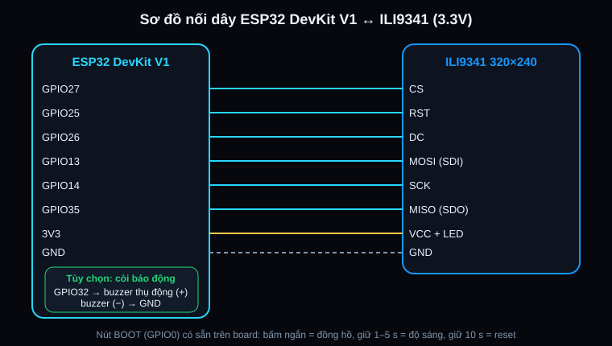

# Sơ đồ nối dây

Logic **3.3 V**. Không cấp 5 V vào chân tín hiệu của ILI9341.

| ILI9341 | ESP32 DevKit V1 | Ghi chú |
|---|---|---|
| CS | GPIO27 | |
| RST | GPIO25 | |
| DC | GPIO26 | |
| MOSI (SDI) | GPIO13 | |
| SCK | GPIO14 | |
| MISO (SDO) | GPIO35 | GPIO35 chỉ là chân vào, đúng cho MISO |
| VCC, LED | 3V3 | Đèn nền nối thẳng 3V3 nên độ sáng được chỉnh bằng phần mềm |
| GND | GND | |

## Tùy chọn

| Linh kiện | Chân | Ghi chú |
|---|---|---|
| Buzzer thụ động (còi báo động) | GPIO32 → (+), (−) → GND | Dùng buzzer **thụ động**; buzzer chủ động cũng kêu nhưng chỉ ra một tần số. Bật trong Web Setting → Cảnh báo → Còi báo động. Đổi chân bằng `-D BUZZER_PIN=xx` trong `platformio.ini` |
| Nút BOOT (GPIO0) | Có sẵn trên board | Bấm ngắn: bật/tắt đồng hồ · giữ 1–5 giây: đổi độ sáng 100/70/40% · giữ **10 giây**: reset toàn bộ về mặc định (xóa cả Wi-Fi và PIN) |

## Lưu ý về giờ

ESP32 không có pin RTC. Giờ cho đồng hồ chờ và chế độ giảm sáng ban đêm lấy từ:

1. NTP qua Wi-Fi, hoặc
2. App Android bridge gửi giờ điện thoại qua BLE (mỗi 10 phút), nên vẫn có giờ khi không có Wi-Fi.

Nếu muốn có giờ hoàn toàn độc lập, có thể gắn thêm module RTC DS3231 (I2C). Firmware chưa hỗ trợ module này.
